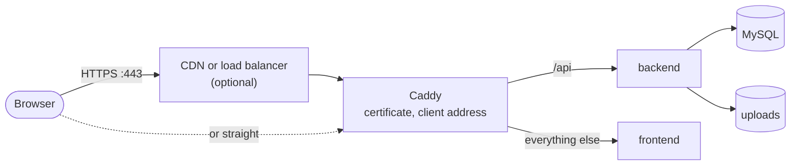

# Deploy

Running INATrace on one server you reach with ssh: a VM in any cloud, Debian or Ubuntu, with
Docker. Caddy at the edge serves HTTPS and routes like the [dev stack](dev-stack.md)'s gateway;
the frontend and backend images and MySQL run behind it.

The platform brings the scheme: the Compose file, the Caddy configuration, backup scripts and a
CLI that saves typing. What runs and how is yours to decide: the image versions, the registry,
the domain, the mail server, what sits in front, where backups go. Nothing picks a version for
you or updates on its own.



Each server is an **instance**: a directory on your machine, `deploy/instances/<name>/`
(git-ignored), with its `.env`, every setting including the passwords, and
`backend.local.properties`, your additions to the backend's configuration. `inatrace deploy up`
syncs [`deploy/server/`](../deploy/server/) and the instance's files to `~/inatrace` on the
server, with rsync, and runs Compose there. Everything the CLI does over ssh is a plain command
you can run [by hand](#by-hand). For one deploy from start to end, see the [example on Google
Cloud behind Cloudflare](deploy-example-gcp-cloudflare.md).

## What you need

* **A server** (or, to try it, [a local VM](#try-it-on-a-local-vm)): Debian or Ubuntu (tested on
  Debian 13, Ubuntu 24.04 and 26.04), 2 CPUs and 4 GB of memory at least (INATrace uses about 1 GB), with
  * a user you log in as with an ssh key, who can use `sudo`
  * ports 22, 80 and 443 open (in the cloud's firewall or security group); 80 only serves the
    Let's Encrypt challenge and redirects to 443
* **A domain**, optional: a DNS record pointing at the server, or at your CDN. Without one,
  people use the server's IP address and the certificate is self-signed (browsers warn).
* **Your machine**: the platform set up as in [Getting started](getting-started.md) (the
  `inatrace` CLI, which needs [uv](https://docs.astral.sh/uv/)), `ssh` and `rsync` (the dev
  container has them).
* **ssh to the server, set up**: `ssh <destination>` logs in without asking anything (key in your
  agent, host key accepted once).
* **The images**: a backend and a frontend version that exist in the registry you choose
  (default `ghcr.io/agstack/inatrace-backend` and `-frontend`).

The CLI hands the destination to `ssh` as is, so whatever is not `user@host` (a port other than
22, a key, a jump host) goes in your `~/.ssh/config`, and the instance names the `Host`:

```
Host inatrace-prod
    HostName 203.0.113.10
    Port 2222
    User admin
```

In the dev container, `~/.ssh/config` is the container's own (it persists with its home) and
the keys come from your host's agent, so leave `IdentityFile` out.

## Try it on a local VM

No server yet, or one to try a change on first: `inatrace vm` makes a VM on your machine that
takes a deploy as a fresh cloud server would, from a distribution's cloud image:

```
inatrace vm create demo        # Ubuntu 26.04, 4 GB, 2 CPUs (--distro debian-13 or rocky-10)
inatrace deploy init demo      # its public address: 127.0.0.1
inatrace deploy up demo        # the site: https://127.0.0.1:10443
```

`create` first checks this machine: x86_64 with KVM usable by you, QEMU (`qemu-system-x86_64`,
`qemu-img`), `cloud-localds`, `curl`, `ssh`, and a key in your ssh agent. What is missing it
lists with the package that brings it, and installs nothing (the dev container has them all).
Then it shows what it will do and, once you confirm, downloads the image (once, into
`~/.cache/inatrace/images`), makes a disk on top of it in `~/.local/share/inatrace/vms/<name>`,
gives the image's user (`ubuntu`, `debian`, `rocky`) your agent's keys and `sudo` through
cloud-init, and starts it with its ports on 127.0.0.1: ssh from 2022, HTTP from 10080, HTTPS from
10443 (the next VM takes the next ones; `--ssh-port` and the like choose them). It adds `Host
<name>` to `~/.ssh/config`, with the VM's host key in its own file, accepted on first contact,
so the name is the ssh destination `deploy init` asks for; and waits until it lets ssh in.

Without a domain, the certificate is self-signed, for 127.0.0.1: the browser warns once. The
site's address for the CLI is `https://127.0.0.1`; from your machine it is reached through the
forwarded port, so `deploy smoke demo --url https://127.0.0.1:10443`.

`inatrace vm list` shows them, running or not, with their ports; `vm stop <name>` powers one off
and `vm start <name>` starts it again, disk as it was; `vm destroy <name>` removes it, its disk
and its `Host` (the image stays, for the next one). Each takes `--json`; `create` and `destroy`,
`--dry-run`.

## The server

It needs Docker Engine with its Compose plugin, from Docker's repository (the distribution's
own packages are often too old, or Podman), your user able to run it, rsync, which copies the
files there, and cron, which runs the scheduled backup. `inatrace deploy init` checks, and
where a profile fits the distribution offers to install them; later, `inatrace deploy prepare
<name>` does the same. Either runs the profile's script there, with `sudo` (it may ask your
password), and logs in again so the `docker` group applies:

| Distributions | Profile |
|---|---|
| Debian, Ubuntu and their derivatives | [`deploy/prereqs/debian.sh`](../deploy/prereqs/debian.sh) |
| Red Hat Enterprise Linux, Rocky Linux, AlmaLinux, CentOS Stream | [`deploy/prereqs/rhel.sh`](../deploy/prereqs/rhel.sh) |

By hand, the same script:

```
scp deploy/prereqs/debian.sh <server>: && ssh -t <server> sh debian.sh
```

then log out and in again, and `docker info` works without `sudo`. Other distributions:
[Docker's install guide](https://docs.docker.com/engine/install/), plus rsync and cron.

On the RHEL family, SELinux stays as it is (enforcing, usually): Docker Engine runs containers
without SELinux labels unless told to, so the mounted files need none. With firewalld running,
the profile opens HTTP and HTTPS in it. Minimal and cloud images of RHEL 10 and its rebuilds
lack `kernel-modules-extra`, whose `xt_addrtype` Docker's network rules need: the profile
installs it for the running kernel. If that version has left the repositories, it says so:
update, reboot into the new kernel, and `prepare` again. Tested on Rocky Linux 10.2, SELinux
enforcing, through a reboot.

Being in the `docker` group is as good as root on that server: give ssh access to it only to
whom you would give root.

## Create an instance

On your machine, in the platform:

```
inatrace deploy init <name>
```

The name is yours (`prod`, `demo`...). It asks everything first, with a default where one can
be found (Enter keeps it), and meanwhile only looks: it logs in, checks the system, Docker and
rsync, and finds the public address. Then it shows a summary of the answers and of what it will
do, and changes nothing until you confirm:

| Question | Notes |
|---|---|
| ssh destination | `user@host`, or a `Host` from `~/.ssh/config` (with a port other than 22, the only way). Without Docker, rsync or cron there, it offers to install them once you confirm. |
| Domain | Empty: by IP address, with a self-signed certificate. |
| Public IP address | Without a domain. The default is what the server sees as its address on the internet (`curl -4 ifconfig.me` there). |
| What sits in front | `direct`, `cdn` or `lb`: see [The client's address](#the-clients-address). |
| Which CDN, its header | With `cdn`: the header with the client's address, filled in for Cloudflare, CloudFront, Fastly and Akamai. |
| Secret header | With `cdn` (recommended) or `lb` (if it can add a header): a random secret it must send. |
| Swagger UI | Closed unless you open it. |
| Images and versions | The registry defaults to `ghcr.io/agstack`; versions have no default. |
| E-mail | SMTP host, port (587: STARTTLS, 465: SSL), username, password, sender. Without it nothing is sent, and an admin activates new users. |

For versions it lists the image's newest tags in its registry (public images; five at a time,
`m` for more): pick a number or type any tag.

Every answer can be a flag instead (`inatrace deploy init --help`); with all of them and
`--auto-approve` (which approves the summary, and nothing else), nothing is asked, for scripts
and CI:

```
INATRACE_DEPLOY_MAIL_PASSWORD=... inatrace deploy init prod --auto-approve \
  --ssh admin@203.0.113.10 --install --domain inatrace.example.org --front direct --no-swagger \
  --backend-image ghcr.io/agstack/inatrace-backend --backend-version 2.40.3 \
  --frontend-image ghcr.io/agstack/inatrace-frontend --frontend-version 2.34.0 \
  --mail --mail-host smtp.example.org --mail-port 587 --mail-username inatrace \
  --mail-from inatrace@example.org
```

The database passwords and the token signing key are generated. Once you confirm, it saves
`deploy/instances/<name>/.env` (**keep a copy of it somewhere safe**, the passwords are in it)
and installs Docker, rsync and cron if you asked.
Every setting is described in [`deploy/.env.example`](../deploy/.env.example); the ones the
wizard does not ask for (maps, backups) you set by editing the file. Running `init` again on the
same name changes the answers, keeping the secrets; the summary marks what changed.

## Start it

```
inatrace deploy up <name>
```

It copies the files to `~/inatrace` on the server, pulls the images and starts the containers
one at a time (MySQL, the backend, the frontend, Caddy, then the [monitoring](#monitoring) if
on), each once its health check passes, then checks that the site answers. With a domain, Caddy
gets the certificate from Let's Encrypt as it starts, in a few seconds, and renews it a month
before it ends; the DNS record must already point at the server (or the CDN), and ports 80 and
443 must be open. It keeps it in a volume (`inatrace_caddy-data`): recreating Caddy reuses it.
Let's Encrypt allows 5 certificates alike a week: for tests that obtain them again and again,
`INATRACE_TLS=acme-staging` uses its staging instead, with far higher limits and a CA no browser
trusts; back to `acme`, the production certificate kept in the volume is used again.

### The first admin

New users register on the site, then an admin activates them; and a user who belongs to no
company cannot get past the login (the frontend asks to pick one). The first admin has nobody to
activate them, and a new installation has no company. One command makes them:

```
inatrace deploy admin <name> you@example.org --company "Your organization" --create
```

`--create` registers the user as the site's form would (from inside the server, so no DNS or
CDN in the way), asking the password twice, hidden; `INATRACE_DEPLOY_ADMIN_PASSWORD` gives it
instead, and `--generate-password` makes one up and shows it once. Then the user becomes an
active system admin, with a first company they administer. It changes the database directly,
and is safe to repeat: a registered user keeps their password, an existing company or link is
kept. `--dry-run` shows what it would do.

Without `--create`, the user registers on the site first, at `https://<site>/en/register` (the
login page has no link to it), confirming the address with e-mail on. Then log in; more users
and companies are made from the site.

## Change or update

Edit `deploy/instances/<name>/.env` (or run `init` again), then `inatrace deploy up <name>`.
`inatrace deploy up <name> --dry-run` first shows what it would do, changing nothing: the files
it would add, change or remove on the server, and what Compose would create, recreate or remove
(Compose's own dry run). Every command that changes something takes `--dry-run` (`-n`).

An update is the same: set the new `INATRACE_BACKEND_VERSION` or `INATRACE_FRONTEND_VERSION`,
then `up`. When it already runs and the backend or the database is about to change (a new
version, a changed setting of theirs), it backs up first; `--backup` always does, `--no-backup`
never. So going back is setting the old version and restoring that backup: the backend migrates
the database forward only, so an older backend may not run on a database a newer one touched.

The files in `deploy/server/` follow the platform's version: after updating your checkout of the
platform, `up` sends the new ones. `.env` and `backend.local.properties` are yours, and only
change when you change them.

A changed `Caddyfile` or `backend.properties` (or `backend.local.properties`) does not change
the container's configuration, so Compose would not recreate it: `up` restarts Caddy or the
backend then.

`up` makes `~/inatrace` match: a file there that is neither in `deploy/server/` nor in the
instance is removed (`backups/` stays). Your own files go in the instance directory, and travel
with it; one with the name of a `deploy/server/` file replaces it. For instance a
`compose.override.yaml`, which Compose merges into `compose.yaml`:

```yaml
services:
  backend:
    environment:
      JAVA_TOOL_OPTIONS: -Xmx1g
```

`deploy status <name>` shows whether the site answers and the server's own certificate (who
issued it, how many days it has left: in yellow under 14, when renewing must have failed, in red
under 7 or untrusted, which also fails the exit code), the server (load, memory, disk), each
container (state, image, CPU, memory, uptime) and the backups (the newest, how many, the
schedule); `-w`
redraws it full screen every two seconds (`-w 10`: every ten) until Ctrl+C, and its exit code
says whether all is well.
`deploy logs <name> [service] [-f]` shows the containers' logs (`caddy`, `frontend`, `backend`,
`mysql`). `deploy smoke <name>` runs the [smoke tests](smoke-tests.md#against-a-deployment) that
only read against it: the site and the API from outside, the images, the database and the logs
over ssh.

## Monitoring

```
inatrace deploy dashboard <name>            # http://localhost:8090, until Ctrl+C
inatrace deploy dashboard <name> -p 9000    # on another local port
```

With `INATRACE_MONITORING=on` (asked by `init`, on by default for a new instance), `up` also runs
[Beszel](https://github.com/henrygd/beszel): a dashboard of the server (CPU, memory, disk,
network, load) and of each container (CPU, memory, network, health), with their history, in
about 20 MB. Its hub listens on the server's `127.0.0.1:8090` only, never published:
`deploy dashboard` forwards a port on your machine to it through ssh, and you open it in your
browser, already logged in (whoever reaches it has ssh to the server anyway). In the dev
container, have the IDE forward that port to your machine too.

`up` sets it up alone: the hub's user (its password generated in `.env`), the agent's key (the
hub's, read through its API and kept in `.env`), the server added to the hub. Turned off, `up`
removes its containers; its history stays, in the `inatrace_beszel-data` volume. The history
goes back 30 days, ever coarser (each minute for the last hour, ..., every 8 hours for the last
30 days): Beszel removes the rest itself, a few MB in all, and the periods are not configurable. The dashboard
has alerts too (CPU, memory, disk, the server down...), set up in it: Beszel's settings take an
SMTP server or other notification services.

Its agent reads Docker's socket, read only, to see the containers: Docker's API is as good as
root on the server, which is why the monitoring can be turned off. Its containers run like the
others (uid 10003, no capabilities, no new privileges); the agent is in the server's `docker`
group, whose id `up` reads there (`INATRACE_DOCKER_GID`).

## Stop it

```
inatrace deploy down <name>
```

It stops and removes the containers, one at a time, so the site goes offline. The database data,
the uploads, the certificates and the backups stay on the server (Docker volumes and
`~/inatrace`), and `inatrace deploy up <name>` starts it again as it was. Erasing them is by
hand, on the server.

## Destroy it

```
inatrace deploy destroy <name>        # asks you to type the name
inatrace deploy destroy <name> -n     # what would go
```

It undoes what `up` did on the server: the containers, the volumes (the database, the uploads,
the certificates, the monitoring's history), the images, `~/inatrace` with the backups in it,
and the scheduled backup's line in the crontab. First it backs up, and copies here every backup
of the server not here yet (`--no-backup` skips both), so nothing is lost: they stay in
`deploy/instances/<name>/backups/`, with the instance's `.env`. What `prepare` installed stays
(Docker, rsync, cron), and so does whatever lies outside the CLI's reach: the server itself,
its DNS record, a CDN's rules. Typing the name confirms it; `--auto-approve` skips that.

To bring it back, on the same server or another (change `INATRACE_SSH`): `init` sees the backups
here and asks which one to restore, and `up` takes it:

```
inatrace deploy up <name> --restore newest    # or a time from backup list
```

It starts everything, sends that backup to the server when it is only here, and restores it.

## Backups

```
inatrace deploy backup list <name>                  # on the server and here, and when the next ones come
inatrace deploy backup create <name>                # one now
inatrace deploy backup download <name> [<time>...]  # copy them here (without times: those not here yet)
inatrace deploy backup restore <name> <time>        # put one back, from the server or from here
inatrace deploy backup delete <name> <time>...      # delete some, once confirmed (--local: the copies here)
```

A backup is a dump of the database and an archive of the uploads, in `~/inatrace/backups` on
the server, named by time (UTC). One runs on its own every day at midnight, the server's time
(`INATRACE_BACKUP_SCHEDULE`: a cron expression, such as `0 3 * * *` for 3 in the morning, or
`off`), from the deploying user's crontab, which `up` keeps (`crontab -l` shows it; its output
goes to `backups/scheduled.log`; with the containers down it skips). Each new one removes those
older than 7 days (`INATRACE_BACKUP_DAYS`): by age, not by count, so a burst of backups (several
`up`s in a row) never pushes an older one out early. `up` also makes one before changing the
backend or the database, and `status` shows the newest and the schedule.

They stay on the server, so they do not survive losing it: `download` copies them to your
machine, into `deploy/instances/<name>/backups/` (git-ignored with the instance, readable by
you alone: a dump holds every password hash), where they stay until you delete them; `up` never
sends them back. `list` shows where each one is, and `restore` takes one that is only here: it
sends it to the server first, with rsync. Keeping copies elsewhere too is up to you (your
cloud's disk snapshots, a cron job with `rclone`...). Restoring replaces the
database and the uploads, stopping the backend meanwhile and waiting until it is healthy again;
it backs up the current state first (`--no-backup` skips it), so a restore can be undone with
another. `delete` shows what it would remove and how many are left, and asks first
(`--auto-approve` skips that, `-n` only shows); it never removes the last one left without
`--force`.

## The client's address

The backend records who made each request (its request log, and errors), taking the first
address in `X-Forwarded-For`. That header is whatever the client sent, unless the edge replaces
it, so Caddy always replaces it with the one address it settled on. How it settles on it depends
on what sits in front of the server (`INATRACE_FRONT`):

| In front | The client's address | Can it be forged? |
|---|---|---|
| `direct`: nothing, DNS points at the server | The connection's; any `X-Forwarded-For` is ignored | No |
| `cdn` with the secret header | The CDN's header (`INATRACE_CDN_IP_HEADER`); requests without the secret get `403` | No: only your CDN knows the secret |
| `cdn` without it | The CDN's header, from anyone | Yes, by whoever reaches the server's IP around the CDN, unless a firewall stops them (below) |
| `lb`: a load balancer on the cloud's private network | `X-Forwarded-For` read from the right, skipping private addresses | No: what the client wrote stays on the left |

We trust what the CDN or load balancer reports: they are yours, and they set these headers
themselves.

### Behind a CDN

The connection from the CDN to the server is HTTPS too, with the server's Let's Encrypt
certificate: the challenge goes through the CDN. A CDN ends the TLS itself, so of Let's
Encrypt's two challenges only the one on port 80 (HTTP-01) gets through: Caddy tries the other
first (TLS-ALPN-01, on 443), sees it fail, and uses that one, for the first certificate and the
renewals alike. Leave the CDN's own HTTP-to-HTTPS redirect off: Caddy redirects already, and
the challenge must reach it over plain HTTP. Then:

* **Cloudflare**: SSL/TLS mode *Full (strict)*; when the zone has another mode for other
  names, a *Configuration Rule* for this hostname sets it for this one alone. *Always Use HTTPS*
  off (above). Its header is `CF-Connecting-IP`, which it sets and nobody can change. For the
  secret, add a *Request Header Transform Rule* for the hostname that sets `X-Origin-Secret`
  to the value of `INATRACE_ORIGIN_SECRET`. Tested this way: the first certificate, a new one
  behind the proxy, the client's address in the backend's records, 403 around it; step by step
  in the [example](deploy-example-gcp-cloudflare.md).
* **CloudFront**: add `CloudFront-Viewer-Address` to the origin request policy (it is not sent by
  default), and `X-Origin-Secret` as an origin custom header.
* **Fastly**: `Fastly-Client-IP` can be set by the client unless your service overwrites it with
  `client.ip`; do that, and add `X-Origin-Secret` to requests to the origin.
* **Akamai**: enable `True-Client-IP`, and add `X-Origin-Secret` to requests to the origin.

Without the secret, limit ports 80 and 443 to the CDN's published address ranges in the cloud's
firewall, and keep them up to date. That stops anyone else reaching the server directly, but the
ranges are shared by all of the CDN's customers: another account on it can still reach your
server around your own rules. Only the secret ties the server to your account.

### Behind a load balancer

Point the domain at it, and have it forward to the server's port 443 over HTTPS (port 80 too,
for the Let's Encrypt challenge). It must talk to the server over the private network: Caddy
trusts `X-Forwarded-For` only from private addresses.

A load balancer that only passes TCP through, keeping the client's address (AWS NLB, for one),
adds no header: use `direct`.

## For scripts and agents

Every command takes `--json`: JSON Lines on stdout instead of the screen, nothing asked
([CLI → JSON](cli.md#json)). For `deploy`, plans, the `init` summary, the status, the backups
and the logs come as data, and a missing answer as an `error` event naming its flag.

## By hand

The CLI runs these over ssh; without it, on the server:

1. Copy [`deploy/server/`](../deploy/server/) to `~/inatrace`, with
   [`deploy/.env.example`](../deploy/.env.example) as `~/inatrace/.env` (`chmod 600`) and
   [`deploy/backend.local.properties`](../deploy/backend.local.properties).
2. Fill in `.env`; the secrets are any long random strings of letters and digits
   (`openssl rand -hex 24`).
3. In `~/inatrace`:

   ```
   docker compose up -d          # start, or apply a change
   ./backup.sh                   # back up
   ./restore.sh [<time>]         # list or restore backups
   docker compose ps             # status
   docker compose logs backend   # logs
   ```

4. The first admin, after registering:

   ```
   docker compose exec -u mysql mysql sh -c 'mysql -uroot -p"$MYSQL_ROOT_PASSWORD" inatrace -e \
     "UPDATE User SET role=\"SYSTEM_ADMIN\", status=\"ACTIVE\" WHERE email=\"you@example.org\""'
   ```

## On the server

```
~/inatrace
├── .env, backend.local.properties   the instance's settings
├── compose.yaml                     Caddy, frontend, backend, MySQL; Beszel (monitoring)
├── Caddyfile, caddy/                the edge: one file per choice in .env
├── backend.properties               the backend's fixed settings
├── backup.sh, restore.sh
└── backups/
```

Every container has a health check, which `status` shows: MySQL answers, the backend answers
HTTP (its `/actuator/health` needs a login, so a request without one, answered 401, stands in),
the frontend serves its page, Caddy answers on port 80. Caddy's admin API is off: its
configuration is the `Caddyfile`, and `up` restarts it when that changes.

No container runs as root: Caddy runs as uid 10001, the frontend as `nginx`, the backend and the
backup scripts' file copies as the backend image's user, the monitoring as uid 10003, and MySQL
as `mysql` (its entrypoint
starts as root and switches, as in the official image). None can gain privileges
(`no-new-privileges`, which also disarms setuid binaries in the images), and all Linux
capabilities are dropped, but the few Caddy's binary and MySQL's entrypoint need. The Docker
daemon itself is root, which is why the `docker` group is as good as root.

MySQL's data, the uploads and Caddy's certificates live in Docker volumes (`inatrace_mysql`,
`inatrace_storage`, `inatrace_caddy-data`) that survive `docker compose down`, but not
`down --volumes`.

## Troubleshooting

* **The site does not answer over HTTPS, with a domain**: Caddy could not get the certificate.
  `inatrace deploy logs <name> caddy` says why: the DNS record does not point at the server yet,
  or ports 80/443 are closed. It retries on its own.
* **The browser warns about the certificate**, by IP address: expected, it is self-signed. To
  trust it on your machine, import Caddy's root, from
  `docker compose exec caddy cat /data/caddy/pki/authorities/local/root.crt`.
* **Every request gets `403`**: `INATRACE_ORIGIN_SECRET` is set, and the request did not carry
  it: set up the CDN to send it, or empty the setting and run `up`.
* **`up` waits and gives up**: the backend did not start; `deploy logs <name> backend`. A
  changed `INATRACE_DB_PASSWORD` is a common cause: MySQL keeps the password it was created with.
* **A command was interrupted** (Ctrl+C, a dropped connection): run the same command again,
  every one is safe to repeat. An install left halfway finishes on its own, or at the next
  `prepare`. When sudo asks a password, Ctrl+C goes to the server: if it does not stop, press
  Enter then `~.` to drop the connection.
* **The server's package manager is busy**, or **apt is busy**, **dnf is busy**: something else
  holds apt's lock, or a dnf runs, usually the server updating itself for a few minutes after it
  was created. `init` checks it (reading `/proc/locks`, and whether a dnf runs; no `sudo`) and
  leaves the install for later; nothing waits. Try `inatrace deploy prepare <name>` again in a
  while.
* **`docker compose` does not run over ssh**: Docker, rsync or cron is not installed
  (`inatrace deploy prepare <name>`), or your user is not in the `docker` group yet (log in
  again after `usermod`): see [The server](#the-server).
