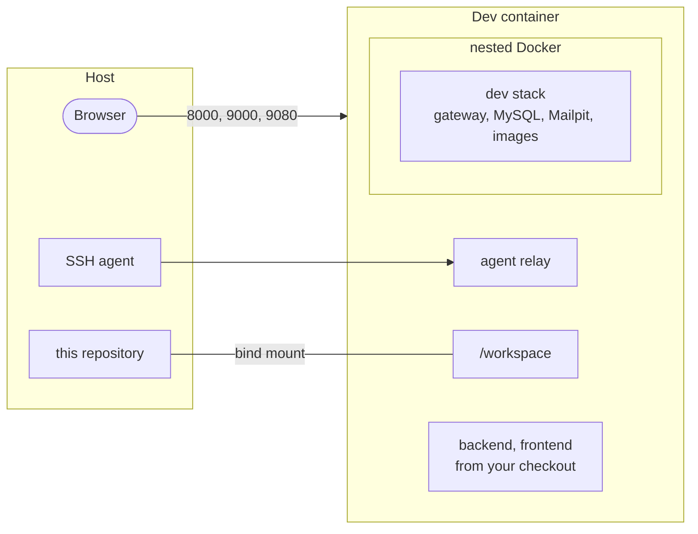

# Dev container

What the dev container provides, what it keeps, and how to work in it. Setting it up is covered
in [Getting started](getting-started.md#with-the-dev-container-recommended).

Ubuntu 24.04 with Java 17, Maven, Node 14, Docker (its own daemon, nested), uv, `gh` and Claude
Code. Everything specific to it lives in `.devcontainer/`: the image, the Compose file, and three
scripts, `initialize.py` and `cleanup.py` on the host and `provision.py` inside.



## Provisioning

`up` runs `.devcontainer/provision.py`: shell and git config, Node 14 (nvm), Claude Code,
Playwright, `inatrace repos sync` and a final `inatrace doctor`. It is idempotent: re-run
`.devcontainer/provision.py` whenever something looks off. It starts no services.

## Ports

| Host | Container | |
|---|---|---|
| 8000 | 8000 | gateway |
| 9000 | 8080 | backend, direct |
| 9080 | 4200 | frontend, direct |

The host ports are [settings](configuration.md#dev-container). MySQL and Mailpit are reachable
from inside only; the links that the images build (the frontend's base URL, the backend's e-mail
links) follow `INATRACE_GATEWAY_PORT`.

## SSH agent and git identity

Your host's SSH agent is reached through a relay; keys never enter the container. Supported:
OpenSSH (`~/.ssh/agent`) and any agent socket in `$XDG_RUNTIME_DIR` (systemd, GNOME,
gpg-agent). An agent in `/tmp` is not visible: start it with
`ssh-agent -a "$XDG_RUNTIME_DIR/ssh-agent.socket"`.

The git identity is the host's `~/.gitconfig`.

## What persists

| Where | Holds |
|---|---|
| volume `<instance>-home` → `/home/dev` | Claude Code login and sessions, shell history, `~/.m2`, `~/.npm`, Node 14, `gh` login, IDE backends |
| volume `<instance>-docker` → `/var/lib/docker` | the nested Docker: images, MySQL data, uploads |
| the repository → `/workspace` | the platform and the cloned repos |

Keep the backend's file storage (`INATrace.fileStorage.root`, `INATrace.documents.root`) under
`/home/dev`: `/tmp` does not survive a rebuild.

## Starting over

On the host, to delete the containers, volumes, images and generated files of this dev container
(`repos/` and `.env` are kept):

```
.devcontainer/cleanup.py --purge --dry-run   # list
.devcontainer/cleanup.py --purge             # delete
```

## Claude Code

Run `claude` from `/workspace`, where it sees the platform and every repo; [`CLAUDE.md`](../CLAUDE.md)
holds the rules. It runs without permission prompts and has the Playwright MCP server. The
container is `privileged` and sees your session's runtime dir: a sandbox against accidents, not
a security boundary.

## IDEs

Tested with the Dev Containers CLI and VS Code. In VS Code:

* Port auto-forwarding is off, because it forwarded stray ports; Claude's `/login` and *Add Port*
  still work. VS Code applies `customizations.vscode` once per home volume: after changing it,
  `rm ~/.vscode-server/data/Machine/.writeMachineSettingsMarker` and rebuild.
* Set `"dev.containers.dockerCredentialHelper": false`: its helper breaks `docker pull` outside
  VS Code terminals.
* Set `"java.autobuild.enabled": false`: the Java extension breaks `mvn verify`.
* In VS Code terminals, `ssh-add -l` asks VS Code's agent; `ssh` itself still uses yours.
* Claude's `/ide` only finds the editor in terminals opened after the extension activated.

JetBrains: untested.

## Troubleshooting

* **`port is already allocated`**: `.devcontainer/cleanup.py`, on the host, lists leftovers and
  who holds the port; or change the ports in `.env`.
* **Docker daemon not answering**: run `/usr/local/share/container-init.sh`, then read
  `/var/log/dockerd.log`.
* **ssh cannot reach the agent**: `ssh-agent-connect < /dev/null` tells whether a host agent
  answers; `/usr/local/share/container-init.sh` restarts the relay.
* **New files are `666` and directories `777`**, in the container and on the host: Docker 29.6+
  gives `docker exec` processes, VS Code's server and all it starts among them, a `0000` umask
  when `dockerd` runs its own containerd, as openSUSE's packages and rootless Docker do (Docker's
  own packages run containerd as a service, with `022`). Git ignores these bits, so `git status`
  does not show it; `inatrace doctor` does, and `inatrace fix-permissions` removes them from the
  platform and the repos (`chmod -R go-w`), whenever it bothers you.

  Or fix it at the source for every container: point `dockerd` at the system's containerd
  service, with `"containerd": "/run/containerd/containerd.sock"` in `/etc/docker/daemon.json`
  and `systemctl enable --now containerd` (restarting Docker restarts every container).
* **MySQL `EXPKEYSIG` while building**: bump the year of `RPM-GPG-KEY-mysql-*` in the Dockerfile.
* **Upgrading from the `src/` layout**: `up` stops and prints the `mv` commands that move the
  clones to `repos/`; run them, then `up` again. Provisioning copies Claude's memory and sessions
  to the new `/workspace` path.
* **Coming from inatrace-devcontainer**: stop its stack first. To keep your Claude login:

  ```
  docker run --rm -v inatrace-claude:/from:ro -v inatrace-platform-home:/home ubuntu:24.04 \
    sh -c 'cp -a /from/. /home/.claude/ && chown -R "$(stat -c %u:%g /home)" /home/.claude'
  ```
