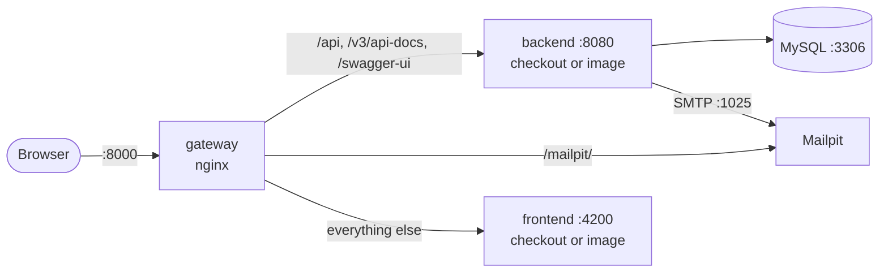

# Dev stack

Running INATrace: the gateway, MySQL and Mailpit around your code, and, per mode, the backend
and the frontend from their images, so you only build what you work on.



## Modes

| `INATRACE_MODE` | backend (:8080) | frontend (:4200) |
|---|---|---|
| `fullstack-dev` (default) | your checkout | your checkout |
| `back-dev` | your checkout | image |
| `front-dev` | image | your checkout |
| `images` | image | image |

```
inatrace stack up                  # in INATRACE_MODE
inatrace stack up --mode images    # another mode, for this run
inatrace stack status              # also: stack logs [-f] [service], stack down [--volumes]
```

`stack up` in another mode removes the containers the new mode does not use. It does not stop
what you run by hand: stop Spring Boot or `ng serve` before switching that part to an image, or
the image fails with `port is already allocated`.

The images and their versions are [settings](configuration.md#dev-stack).

## Running from your checkout

Details in each repo's documentation.

```
cd repos/inatrace-backend && mvn spring-boot:run
cd repos/inatrace-frontend && nvm use 14 && npm install && npm run dev
```

The backend image sends its e-mails to Mailpit as is. A backend from your checkout sends none
until its `application.properties` points at Mailpit:

- `INATrace.mail.sendingEnabled`: `true`
- `spring.mail.host`: `localhost`
- `spring.mail.port`: `1025`
- `spring.mail.properties.mail.smtp.auth`: `false`
- `INATrace.mail.template.from`: `inatrace@localhost`

## Ports and links

Everything goes through the gateway, at `127.0.0.1` (not `localhost`: IPv4 only):

| | |
|---|---|
| The app | <http://127.0.0.1:8000> |
| Mailpit, the e-mails the backend sent | <http://127.0.0.1:8000/mailpit/> |
| Swagger UI (log in through `/api/user/login` first) | <http://127.0.0.1:8000/swagger-ui.html> |

The gateway routes `/api`, `/v3/api-docs` and `/swagger-ui*` to the backend, `/mailpit/` to
Mailpit and the rest to the frontend, like production. A part that is not running answers `502`.

MySQL listens on `127.0.0.1:3306`, with database, user and password `inatrace` (root password
`root`), as the backend's `application.properties.template` expects.

In the dev container, the host reaches these through [published ports](dev-container.md#ports).

## Data

MySQL's data and the backend image's uploads live in volumes that survive `stack down`;
`stack down --volumes` erases them. The stack comes back after a restart, in the mode it was
started in.

## Without the CLI

```
COMPOSE_PROFILES=<mode> docker compose --env-file .env -f dev-stack/compose.yaml up -d
```

## Troubleshooting

* **An `inatrace-mysql` container**, the MySQL of older setups, holds port 3306, so the stack's
  MySQL cannot start. Move its data over, then remove it:

  ```
  docker start inatrace-mysql
  docker exec inatrace-mysql mysqldump -uroot -proot --databases inatrace > tmp/inatrace.sql
  docker rm -f inatrace-mysql
  inatrace stack up
  docker exec -i inatrace-dev-stack-mysql-1 mysql -uroot -proot < tmp/inatrace.sql
  ```

* **The backend's tests fail on Docker 29+**: until agstack/inatrace-backend#46 is merged,
  Testcontainers' default Docker API is too old. Run them with `mvn verify -Dapi.version=1.44`.
